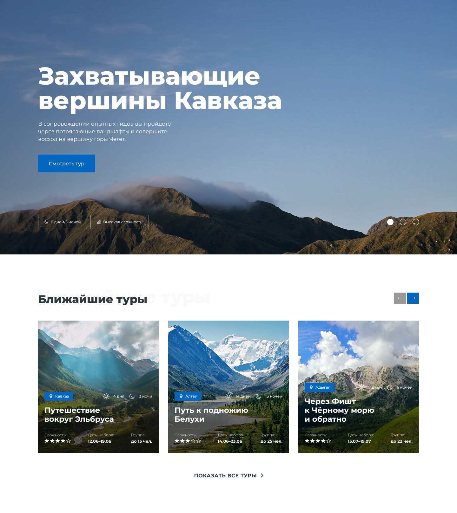

# 📋 Личный проект «Lifetour»

**Самостоятельно выполненный проект, написанный с использованием HTML, CSS и JavaScript в соответствии с техническим заданием, критериями качества HTML Academy, стайлгайдом, принципом Pixel Perfect.**

*Второй проект, выполненный в рамках «Aкселератора» HTML Academy - финального самостоятельного этапа производства.*



## 💡 Обзор выполненных задач

### ✔ Написание HTML-разметки
Создание семантически правильной и структурированной HTML-разметки, обеспечивающей доступность и SEO-оптимизацию.

### ✔ Адаптивная верстка на SCSS
- разработаны адаптивные стили с использованием SCSS, обеспечивающих корректное отображение сайта на различных устройствах (desktop, tablet, mobile).
- реализована **резиновая** верстка, обеспечивающая масштабирование контента между брекпоинтами для гибкого отображения.
- использован подход **Mobile First**, гарантирующий оптимальное отображение на мобильных устройствах.

### ✔ Реализация JavaScript функциональности
Добавление интерактивных элементов и динамической логики с использованием JavaScript (слайдеры выполнены с использованием библиотеки Swiper.js).  Реализованы следующие функции:
- открытие/закрытие мобильного меню в шапке в мобильной и планшетной версиях.
- слайдер с пагинацией в блоке «Hero».
- слайдер с навигацией в блоке «Ближайшие туры».
- слайдер с навигацией в блоке «Обучение».
- слайдер с навигацией в блоке «Отзывы».
- слайдер с навигацией в блоке «Преимущетсва», подключаемый на десктопной версии.
- слайдер с навигацией в блоке «Фотогалерея», подключаемый на мобильной и планшетной версиях.
- валидация формы в блоке «Остались вопросы?» с допуском локальных доменов (.рф).
- кастомизация браузерных сообщений об ошибках при вводе невалидных данных и их вывод после попытки отправки формы (в соответствии с ТЗ).
- маска ввода у поля с номером телефона в блоке «Остались вопросы?».
- улучшение производительности за счет ограничения частоты вызовов функций, реализуемое с помощью функции debounce.
- адаптивные тени у заголовков с соблюдением переносов.


## 📖 Библиотеки

- [Swiper.js](https://swiperjs.com/).


## 🛠 Технологии и инструменты

- HTML5
- SCSS
- JavaScript (ES6+)
- БЭМ-методология
- SVG-спрайты, WebP
- оптимизация графики, в т.ч. для Retina-дисплеев
- резиновая верстка
- Gulp
- Git
- VS Code
- Figma


## 📌 Ссылка на проект

https://anastasiya-lemeshko.github.io/lifetour/


## 🚀 Установка и запуск:

**Установка Node.js и NPM**:
- Установите Node.js (поддерживаемая версия 18+).
- Для установки зависимостей необходимо выполнить команду
```bash
npm i
```

**Запуск проекта**:
- Запустите сервер с помощью команды
```bash
npm run start
```
- Сервер будет доступен по адресу `http://localhost:3000`.
